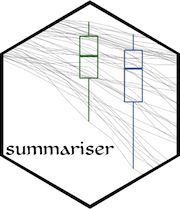

<!-- README.md is generated from README.Rmd. Please edit that file -->

```{r, include = FALSE}
knitr::opts_chunk$set(
  collapse = TRUE,
  comment = "#>",
  fig.path = "man/figures/README-",
  out.width = "100%"
)
```
# summariser 

<!-- badges: start -->
[](https://travis-ci.org/condwanaland/summariser) [](https://codecov.io/gh/condwanaland/summariser)
<!-- badges: end -->

`summariser` provides simple functions for calculating the most common summary statistics, particularly confidence intervals.

## Installation

You can install the released version of summariser from [CRAN](https://CRAN.R-project.org) with:

``` r
install.packages("summariser")
```

And the development version from [GitHub](https://github.com/) with:

``` r
# install.packages("devtools")
devtools::install_github("condwanaland/summariser")
```

## Using summariser

`summariser` is designed to fit into the tidyverse 'piping' style. Just pass a dataframe, and your measurement variable of interest into `summary_stats`.

```{r}
library(summariser)
library(dplyr)
iris %>% 
  summary_stats(Sepal.Length)
```


If you want to group your dataframe by categorical factors, simply use dplyrs `group_by` before piping to `summary_stats`
```{r}
iris %>%
  group_by(Species) %>% 
  summary_stats(Sepal.Length)
```


By default, `summariser` uses a normal distribution to calculate confidence intervals. If you would rather use a t distribution, just pass this to the `type` parameter.
```{r, eval=FALSE}
iris %>%
  group_by(Species) %>% 
  summary_stats(Sepal.Length, type = "t")
```
