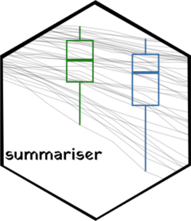

<!-- README.md is generated from README.Rmd. Please edit that file -->
summariser 
=============================================================================================

<!-- badges: start -->
[](https://travis-ci.org/condwanaland/summariser) [](https://codecov.io/gh/condwanaland/summariser) <!-- badges: end -->

`summariser` provides simple functions for calculating the most common summary statistics, particularly confidence intervals.

Installation
------------

You can install the released version of summariser from [CRAN](https://CRAN.R-project.org) with:

``` r
install.packages("summariser")
```

And the development version from [GitHub](https://github.com/) with:

``` r
# install.packages("devtools")
devtools::install_github("condwanaland/summariser")
```

Using summariser
----------------

`summariser` is designed to fit into the tidyverse 'piping' style. Just pass a dataframe, and your measurement variable of interest into `summary_stats`.

``` r
library(summariser)
library(dplyr)
#> 
#> Attaching package: 'dplyr'
#> The following objects are masked from 'package:stats':
#> 
#>     filter, lag
#> The following objects are masked from 'package:base':
#> 
#>     intersect, setdiff, setequal, union
iris %>% 
  summary_stats(Sepal.Length)
#>       mean        sd   n         se        ci
#> 1 5.843333 0.8280661 150 0.06761132 0.1325157
```

If you want to group your dataframe by categorical factors, simply use dplyrs `group_by` before piping to `summary_stats`

``` r
iris %>%
  group_by(Species) %>% 
  summary_stats(Sepal.Length)
#> # A tibble: 3 x 6
#>   Species     mean    sd     n     se     ci
#>   <fct>      <dbl> <dbl> <int>  <dbl>  <dbl>
#> 1 setosa      5.01 0.352    50 0.0498 0.0977
#> 2 versicolor  5.94 0.516    50 0.0730 0.143 
#> 3 virginica   6.59 0.636    50 0.0899 0.176
```

By default, `summariser` uses a normal distribution to calculate confidence intervals. If you would rather use a t distribution, just pass this to the `type` parameter.

``` r
iris %>%
  group_by(Species) %>% 
  summary_stats(Sepal.Length, type = "t")
```
